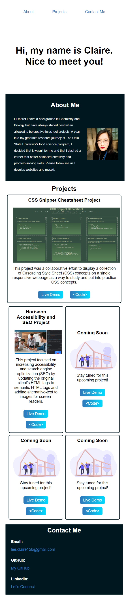

# GWU_HW2_Portfolio

## Description
This project is a portfolio page that will showcase the work Claire Lee has deployed. As more projects are completed, they will be displayed here under the Projects section of the page. This allows for the convenience of a central hub for her projects and their repositories. This project also demonstrated an intimate understanding of HTML and the following CSS concepts: flexbox, media queries, and CSS variables.

## Usage

* Please click on the following link of the deployed website, https://leeclaire156.github.io/Portfolio_Page/

* Click on any of the project images to go to their deployed webpages.

* The following display should appear on screens at screen sizes 992px and above:

    

* The following display should appear on screens at screen sizes 768px to 992px:

    

* The following display should appear on screens at screen sizes 768px and below:

    

## Credits

* Credit to Coming-Soon.SVG belongs to [Undraw](https://undraw.co/search).

* Credit to the Home animation belongs to [Chris Spittles](https://stackoverflow.com/questions/6805482/css3-transition-animation-on-load) on Stack Overflow.

* Credit and special thanks to W3Schools for providing a tutorial on [grid area](https://www.w3schools.com/cssref/pr_grid-area.php)

## Features

* Responsive layout that adapts to desktop, tablet, and mobile devices.

* Each project's image will lead to the deployed webpage when clicked on.

* Each project also has a Live Demo button for the deployed webpage, and a &#60;Code&#62; button for their repositories to increase user interface friendly design.

* Clicking on the email will open up a window to send an email to lee.claire156@gmail.com

* Color palette can easily be swapped out with using CSS root.

